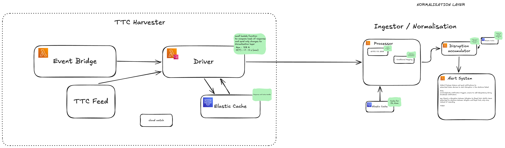

# TTC Watch / System Feed Processor



## Overview & Purpose
The purpose of the TTC Watch / System Feed Processor is to harvest, normalize, and process public transit data. It pulls real-time data from the TTC open data portal (in GTFS format) and transforms it into structured JSON data. This transformed data serves as a centralized source for multiple downstream applications, enabling features such as visualization of service alerts and sending real-time notifications to users.

## Description
This project implements an automated, scalable pipeline for transit data ingestion and processing. The data is periodically harvested, ingested, normalized, and finally accumulated for consumption. The pipeline handles data transformation from GTFS to JSON. The end goal is to provide a reliable feed that can be consumed by other services, such as notification engines (like Firebase) and user-facing applications.

## Infrastructure & Cloud Services
The system is entirely cloud-native, built and orchestrated on **AWS** using Terraform. 

Every service in the infrastructure is integrated with Amazon CloudWatch for centralized logging and monitoring. 
*Note: All CloudWatch log groups are explicitly configured with a retention period of 6 hours to optimize costs and meet data retention policies.*

The primary services used in this architecture include:
* **AWS EventBridge**: Triggers the scheduled harvesting and orchestrates event-driven workflows.
* **AWS Lambda**: The core compute layer, separated into distinct microservices:
  * **Harvester**: Pulls raw GTFS data from the TTC open data endpoint.
  * **Ingestor**: Receives the raw data and prepares it for processing.
  * **Normaliser**: Transforms the GTFS format into standardized JSON data.
  * **Accumulator**: Aggregates and stores the structured data for downstream access.
* **Amazon CloudWatch**: Handles logging and metrics for all services.
* **Firebase**: External service used for sending push notifications based on processed data (e.g., service alerts).
* **Amazon DynamoDB / ElastiCache**: Data storage and caching layers for efficient access to processed feed data.

## Directory Structure
```text
.
├── cloudwatch/          # Terraform modules for CloudWatch log groups and metrics
├── dynamodb/            # Terraform modules for DynamoDB tables
├── elastic_cache/       # Terraform modules for ElastiCache clusters
├── eventbridge/         # Terraform modules for EventBridge rules and targets
├── lambda/              # Source code and infrastructure code for Lambda functions
├── main.tf              # Entry point for Terraform infrastructure deployment
├── outputs.tf           # Terraform output definitions
├── variables.tf         # Terraform variable definitions
├── img.png              # System architecture diagram
└── readme.md            # Project documentation
```

## Setup & Deployment
This project uses Terraform for Infrastructure as Code (IaC). To deploy the infrastructure:
1. Ensure you have the AWS CLI configured and Terraform installed.
2. Initialize Terraform: `terraform init`
3. Review the infrastructure plan: `terraform plan`
4. Apply the configuration: `terraform apply`

## Copyright & License
Copyright © 2024. All rights reserved.

